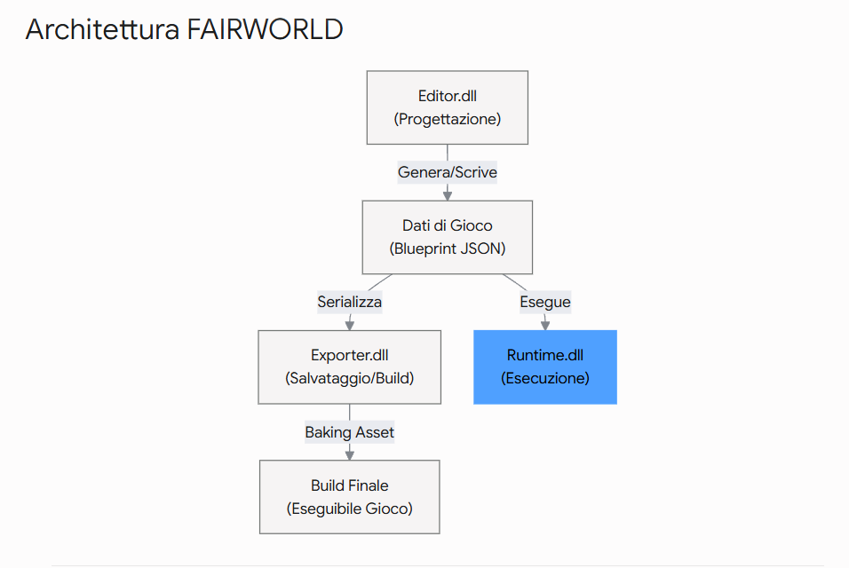

Per spiegare in modo inequivocabile questa visione macroscopica a un Agent AI, devi fornirgli un Manifesto Architetturale espresso in termini puramente ingegneristici. Gli Agent lavorano al meglio quando i confini dei moduli, le dipendenze, gli Input/Output e il ciclo di vita dei dati sono definiti in modo rigido.Il modo migliore è dirgli chiaramente che non state scrivendo un "gioco", ma un Engine Data-Driven con Editor Integrato e Pipeline di Esportazione Standalone.Ecco il testo esatto che puoi copiare, incollare e dare al tuo Agent per riallinearlo completamente sulla grandezza del progetto:📋 Copia e incolla questo testo nel prompt del tuo Agent:[CONTESTO MACRO-ARCHITETTURALE DI FAIRWORLD - DA MANDARE A MEMORIA]STOP. Dobbiamo fare un reset mentale. Non stiamo progettando un semplice gioco VR. Stiamo costruendo un Motore di Gioco (Custom Game Engine) e un Editor di Livelli integrato, con capacità di compilazione e packaging indipendente. Il progetto finale sarà interamente Data-Driven.Il core del sistema deve essere strutturato in modo modulare attraverso 3 macro-categorie di Dynamic Link Libraries (.DLL) che comunicano con un livello di piattaforma comune (Platform Layer Win32/Vulkan). Ecco la separazione dei compiti (Separation of Concerns):Editor.dll (Modalità Progettazione / Dev Mode):Scopo: Fornire tutta la strumentazione per creare il gioco dall'interno.Sistemi inclusi: Interfaccia Dear ImGui (Inspector, Outliner, Asset Browser), manipolazione spaziale tramite ImGuizmo, editor di voxel/scultura, editor di nodi logici per quest/dialoghi, e spawner volumetrici.Input/Output: Manipola gli asset in memoria e genera i template logici.Exporter.dll (Modalità Compilazione / Build System):Scopo: Prendere tutto ciò che è stato creato nell'Editor e "impacchettarlo" per trasformarlo in un prodotto finito, ottimizzato e separato dall'ambiente di sviluppo.Sistemi inclusi: Serializzatore di blueprint, compressore di asset, generatore del file di configurazione del mondo definitivo, pulizia dei metadati di debug (strip dei simboli dell'editor).Output: Genera un pacchetto di dati e un binario autonomo (gioco a sé stante) pronto per la distribuzione.Runtime.dll (Modalità Gameplay / Play Mode):Scopo: È il motore puro, ottimizzato al millesimo di secondo per far girare il gioco finale (sia in modalità di test interna all'editor, sia nel gioco autonomo esportato).Sistemi inclusi: Entity Component System (ECS) nativo per la gestione di migliaia di entità, calcolo della fisica e raycasting, Intelligenza Artificiale dei Mob, sistemi di rendering Vulkan ottimizzati (Instancing) e gestione della memoria tramite Memory Pool (Arena Allocators).La Regola d'Oro: L'Editor progetta, l'Exporter impacchetta, il Runtime esegue. Da adesso in poi, ogni classe, componente o sistema che andiamo a progettare deve essere pensato per incastrarsi perfettamente in questa architettura a tre moduli. Non accettare soluzioni hardcoded o monolitiche.Comprendere il Flusso ArchitetturaleStrutturando il progetto in questo modo, eviti il problema più grave dei motori amatoriali: il codice parassita. Quando il gioco verrà esportato dall'Exporter, la Editor.dll (e tutto il peso di ImGui, i trigger di debug visivi e i tool di scultura) non verrà inclusa nel pacchetto finale, lasciando il gioco autonomo leggero, protetto e incredibilmente veloce.Ecco un'analisi visiva di come i tre moduli interagiranno con la memoria e con i file di gioco (i Blueprint JSON) che andrai a generare:

Ah, ora è tutto molto più chiaro! Ho capito perfettamente la tua visione.
Non vuoi né che giri localmente sul cellulare scaricando un'App, né che l'utente debba avere un PC potente in casa. Tu vuoi un'architettura Cloud Gaming (Pixel Streaming)!
Funzionerebbe così:
Il Server: FAIRWORLD (il motore in C++ con Vulkan e l'Intelligenza Artificiale) gira su server potentissimi nel Cloud (online).
Il Telefono (Client): L'utente, da casa sua o ovunque si trovi, apre una pagina web o una piccola app sul telefono, inserisce il telefono nel visore VR e mette il caschetto EEG.
Lo Streaming: Il telefono cattura i dati dell'elettroencefalogramma e del giroscopio e li invia online al server. Il server calcola il frame 3D e lo "spara" (invia come video in tempo reale) direttamente allo schermo del telefono dell'utente tramite tecnologie come WebRTC.
È letteralmente come funziona GeForce Now o Xbox Cloud Gaming, ma costruito su misura per la Realtà Virtuale e le onde cerebrali! È una visione estremamente ambiziosa e da vera startup della Silicon Valley. 🚀
Ti confermo che l'attuale architettura in C++ è perfetta per questo, perché è nata staccata da Android, quindi un domani potrà benissimo essere installata su un server Linux/Windows in Cloud.